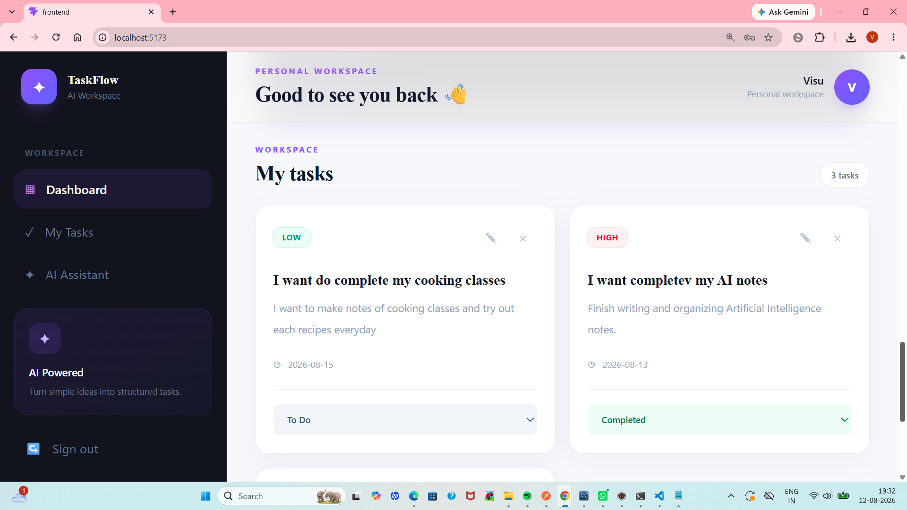
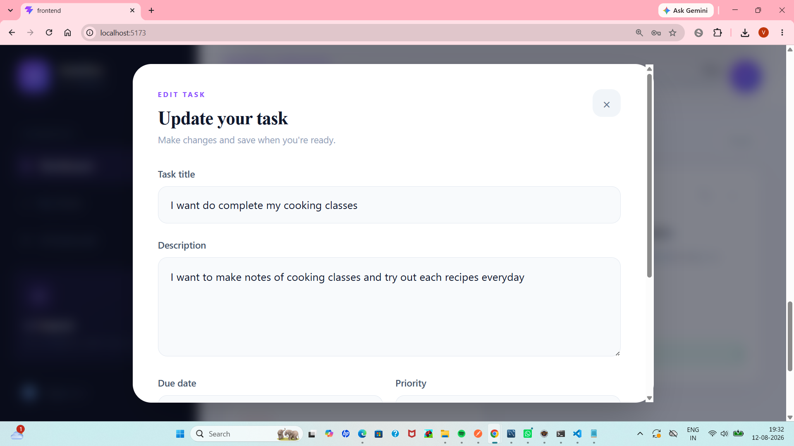
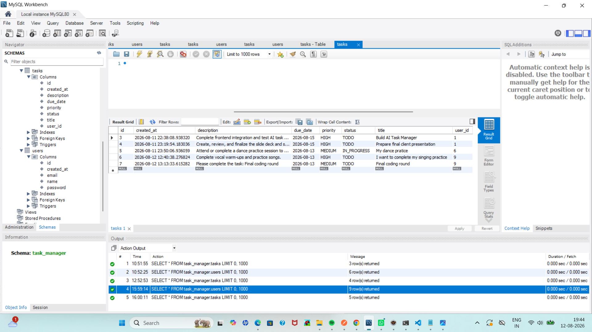

Yes. Since you used **MySQL**, developed the **Java/Spring Boot backend in Eclipse**, and developed the **React frontend in VS Code**, here is the complete cleaned-up README.

I have also removed the **deployment** and **demo video** sections as requested. I’ve avoided claiming a specific AI provider since you haven’t specified which one you used.

Copy everything below into your GitHub `README.md`.

````markdown
# AI-Powered Task Management Portal

A full-stack AI-powered task management application developed as part of
the **Java Full Stack Developer Intern Take-Home Assignment**.

The application allows users to manage their tasks, track task progress,
and use an AI-powered feature to assist with task management.

---

## 📌 Project Overview

The AI-Powered Task Management Portal is a full-stack web application
consisting of a React frontend, Java Spring Boot backend, and MySQL
database.

The application provides users with a simple interface to create,
manage, update, and track their tasks. It also includes an AI-powered
feature to assist users with task-related operations.

---

## 🚀 Features

- User registration
- User login
- User authentication
- Task creation
- View tasks
- Update tasks
- Delete tasks
- Task status management
- Task priority management
- Task due dates
- Task creation timestamps
- Dashboard for task overview
- AI-powered task assistance
- REST API communication
- MySQL database integration
- Responsive frontend interface

### Task Status

Tasks can have the following statuses:

- `TODO`
- `IN_PROGRESS`
- `DONE`

---

# 🛠️ Tech Stack

## Frontend

- React.js
- Vite
- JavaScript
- CSS
- REST API

### Frontend Development Environment

The frontend was developed using:

- **Visual Studio Code (VS Code)**
- Node.js
- npm

---

## Backend

- Java
- Spring Boot
- Spring REST
- Maven

### Backend Development Environment

The backend was developed using:

- **Eclipse IDE**

The backend provides REST APIs that communicate with the React
frontend and interact with the MySQL database.

---

## Database

- **MySQL**
- MySQL Workbench

MySQL is used for storing:

- User information
- Task information
- Task status
- Task priority
- Due dates
- Creation timestamps

---

## AI

The application includes an AI-powered feature to assist users with
task-related operations.

The AI functionality is integrated with the backend and can be used to
assist in generating or structuring task-related information.

---

# 🏗️ System Architecture

The application follows a three-layer full-stack architecture.

```text
                         ┌─────────────────┐
                         │      USER       │
                         │                 │
                         │ Web Browser     │
                         └────────┬────────┘
                                  │
                                  ▼
                    ┌─────────────────────────┐
                    │        FRONTEND         │
                    │                         │
                    │     React + Vite        │
                    │                         │
                    │ • Dashboard             │
                    │ • Task Management       │
                    │ • Login / Register      │
                    │ • AI Assistant          │
                    └────────────┬────────────┘
                                 │
                          REST API / JSON
                                 │
                                 ▼
                    ┌─────────────────────────┐
                    │         BACKEND         │
                    │                         │
                    │   Java + Spring Boot    │
                    │                         │
                    │ • REST Controllers      │
                    │ • Business Logic        │
                    │ • Task Management       │
                    │ • Authentication        │
                    │ • AI Integration        │
                    └────────────┬────────────┘
                                 │
                                 │ SQL
                                 ▼
                    ┌─────────────────────────┐
                    │        DATABASE         │
                    │                         │
                    │         MySQL           │
                    │                         │
                    │ • users                 │
                    │ • tasks                 │
                    └─────────────────────────┘
````

---

# 🔄 Application Flow

The basic application flow is:

```text
User
  │
  ▼
React Frontend
  │
  │ REST API Request
  ▼
Spring Boot Backend
  │
  ├──────────────► AI Service
  │                    │
  │                    ▼
  │               AI Response
  │
  ▼
MySQL Database
  │
  ▼
Spring Boot Backend
  │
  │ JSON Response
  ▼
React Frontend
  │
  ▼
User
```

# 📂 Project Structure


## Project Structure

```text
AI-Task-Manager/
│
├── frontend/
│   ├── public/
│   ├── src/
│   │   ├── assets/
│   │   ├── App.jsx
│   │   ├── main.jsx
│   │   └── index.css
│   ├── package.json
│   ├── package-lock.json
│   └── vite.config.js
│
├── backend/
│   └── src/
│       └── main/
│           ├── java/
│           │   └── task_manager_backend/
│           │       ├── BackendApplication.java
│           │       ├── controller/
│           │       ├── dto/
│           │       ├── entity/
│           │       ├── exception/
│           │       ├── repository/
│           │       ├── security/
│           │       └── service/
│           │
│           └── resources/
│
├── screenshots/
│
├── .gitignore
│
└── README.md


# 🗄️ Database Design

The application uses MySQL as the primary database.

The database contains the main tables required for user management and
task management.

## Users Table

| Column       | Description                |
| ------------ | -------------------------- |
| `id`         | Primary key                |
| `name`       | User name                  |
| `email`      | User email                 |
| `password`   | User password              |
| `created_at` | Account creation timestamp |

## Tasks Table

| Column        | Description             |
| ------------- | ----------------------- |
| `id`          | Primary key             |
| `title`       | Task title              |
| `description` | Task description        |
| `due_date`    | Task due date           |
| `priority`    | Task priority           |
| `status`      | Current task status     |
| `user_id`     | Associated user         |
| `created_at`  | Task creation timestamp |

### Relationship

```text
USERS
  │
  │ 1
  │
  │
  │ N
  ▼
TASKS
```

One user can have multiple tasks.

Each task belongs to a specific user through `user_id`.

---

# 🔐 Authentication

The application provides authentication for users.

The general authentication flow is:

```text
User Registration
       │
       ▼
User Account Created
       │
       ▼
User Login
       │
       ▼
Authentication
       │
       ▼
Access Task Management
```

Protected task operations are available only to authenticated users.

---

# 🤖 AI Integration

The application contains an AI-powered task assistance feature.

The general AI workflow is:

```text
User enters task information
          │
          ▼
React Frontend
          │
          ▼
Spring Boot Backend
          │
          ▼
AI Service
          │
          ▼
AI Generated Result
          │
          ▼
Spring Boot Backend
          │
          ▼
React Frontend
          │
          ▼
User
```

The AI functionality is designed to assist users with task-related
operations such as understanding task information and generating
structured task-related content.

The backend acts as the integration layer between the frontend and the
AI service.

---

# 🔌 API Endpoints

The backend provides REST APIs for authentication and task management.

## Authentication APIs

| Method | Endpoint             | Description         |
| ------ | -------------------- | ------------------- |
| POST   | `/api/auth/register` | Register a new user |
| POST   | `/api/auth/login`    | Login user          |

## Task APIs

| Method | Endpoint          | Description         |
| ------ | ----------------- | ------------------- |
| GET    | `/api/tasks`      | Get tasks           |
| GET    | `/api/tasks/{id}` | Get a specific task |
| POST   | `/api/tasks`      | Create a task       |
| PUT    | `/api/tasks/{id}` | Update a task       |
| DELETE | `/api/tasks/{id}` | Delete a task       |

> Note: The endpoint names above should match the actual endpoints
> implemented in the Spring Boot controllers.

---

# ⚙️ Setup Instructions

## Prerequisites

Install the following software:

* Java JDK
* Eclipse IDE
* Maven
* Node.js
* npm
* MySQL
* MySQL Workbench
* Visual Studio Code
* Git

---

## 1. Clone the Repository

```bash
git clone <YOUR_GITHUB_REPOSITORY_URL>
```

Then open the project:

```bash
cd AI-Task-Manager
```

---

# 2. Database Setup

Open **MySQL Workbench**.

Create the database required by the application.

Example:

```sql
CREATE DATABASE task_manager;
```

Use the database configuration used by your Spring Boot application.

Configure the database connection in:

```text
backend/src/main/resources/application.properties
```

Example:

```properties
spring.datasource.url=jdbc:mysql://localhost:3306/task_manager
spring.datasource.username=YOUR_USERNAME
spring.datasource.password=YOUR_PASSWORD
```

Do not upload your real database password or API keys to GitHub.

---

# 3. Backend Setup

The backend was developed using **Java Spring Boot in Eclipse IDE**.

Open Eclipse and import the `backend` project.

Make sure Maven dependencies are downloaded.

Run the Spring Boot application from Eclipse.

Alternatively, from the backend directory:

```bash
cd backend
mvn spring-boot:run
```

The backend will start on the configured Spring Boot port.

---

# 4. Frontend Setup

The frontend was developed using **React and Vite in Visual Studio Code**.

Open the `frontend` folder in VS Code.

Install the dependencies:

```bash
npm install
```

Start the development server:

```bash
npm run dev
```

Vite will display the local frontend URL in the terminal.

Open that URL in your browser.

---

# 🔄 Running the Complete Application

Start the backend first:

```text
Eclipse
   ↓
Spring Boot Application
   ↓
Backend REST API
```

Then start the frontend:

```text
VS Code
   ↓
npm run dev
   ↓
React + Vite
```

The complete application works as:

```text
Browser
   ↓
React Frontend
   ↓
Spring Boot REST API
   ↓
MySQL Database
```

---

# 📸 Screenshots

The project screenshots are stored in the `screenshots` directory.

Recommended screenshots include:

### Dashboard



### Task Management


###  edit task



### Database



### Login


> Make sure the image filenames in this section exactly match the
> filenames inside the `screenshots` folder.

---

# 📐 ER Diagram

The database relationship can be represented as:

```text
┌──────────────────────────┐
│          USERS           │
├──────────────────────────┤
│ PK  id                   │
│     name                 │
│     email                │
│     password             │
│     created_at           │
└────────────┬─────────────┘
             │
             │ 1
             │
             │ N
             ▼
┌──────────────────────────┐
│          TASKS           │
├──────────────────────────┤
│ PK  id                   │
│     title                │
│     description          │
│     due_date             │
│     priority             │
│     status               │
│ FK  user_id              │
│     created_at           │
└──────────────────────────┘
```

---

# 🖼️ Architecture Diagram

The project architecture consists of:

```text
┌─────────────┐
│    USER     │
└──────┬──────┘
       │
       ▼
┌─────────────────────┐
│ React + Vite        │
│ Frontend            │
└──────────┬──────────┘
           │
           │ REST API
           ▼
┌─────────────────────┐
│ Java Spring Boot    │
│ Backend             │
└───────┬─────────┬───┘
        │         │
        │         │ AI Request
        │         ▼
        │    ┌─────────────┐
        │    │ AI Service  │
        │    └─────────────┘
        │
        │ SQL
        ▼
┌─────────────────────┐
│       MySQL         │
│      Database       │
└─────────────────────┘
```

---

# 🧠 Assumptions

* Each user can manage their own tasks.
* Each task is associated with a user.
* Tasks contain a title and other task-related information.
* Tasks can have different statuses and priorities.
* MySQL is used for persistent data storage.
* React communicates with the Spring Boot backend using REST APIs.
* The backend handles communication with the AI service.
* Sensitive credentials should be stored securely and not committed to
  the GitHub repository.

---

# 🔒 Security

The project follows basic security practices:

* Authentication is required for protected operations.
* Database credentials should not be exposed publicly.
* AI API keys should not be committed to GitHub.
* Sensitive configuration should be managed through environment
  variables or local configuration.

---

# 🚧 Future Improvements

Possible future improvements include:

* Advanced task search
* Task filtering
* Pagination
* Role-based access control
* Automated unit and integration testing
* Swagger/OpenAPI documentation
* Docker support
* Task notifications
* Task reminders
* Improved AI recommendations
* Production deployment

---

# 💻 Development Tools

| Component            | Tool               |
| -------------------- | ------------------ |
| Frontend Development | Visual Studio Code |
| Backend Development  | Eclipse IDE        |
| Database             | MySQL              |
| Database Management  | MySQL Workbench    |
| Frontend             | React + Vite       |
| Backend              | Java + Spring Boot |
| Version Control      | Git + GitHub       |

---

# 👨‍💻 Assignment

This project was developed as part of a **Java Full Stack Developer Intern
Take-Home Assignment**.

The project demonstrates:

* Full-stack web development
* React frontend development
* Java Spring Boot backend development
* REST API development
* MySQL database integration
* Authentication
* Task CRUD operations
* AI-powered functionality
* Database design
* Git and GitHub workflow
* Software architecture
* Project documentation

---

# 📁 Repository Contents

```text
AI-Task-Manager/
│
├── frontend/
│
├── backend/
│
├── screenshots/
│
├── .gitignore
│
└── README.md
```

---

## ⭐ Conclusion

The AI-Powered Task Management Portal demonstrates the implementation
of a complete full-stack application using React, Java Spring Boot, and
MySQL, with an AI-powered feature for task assistance.


